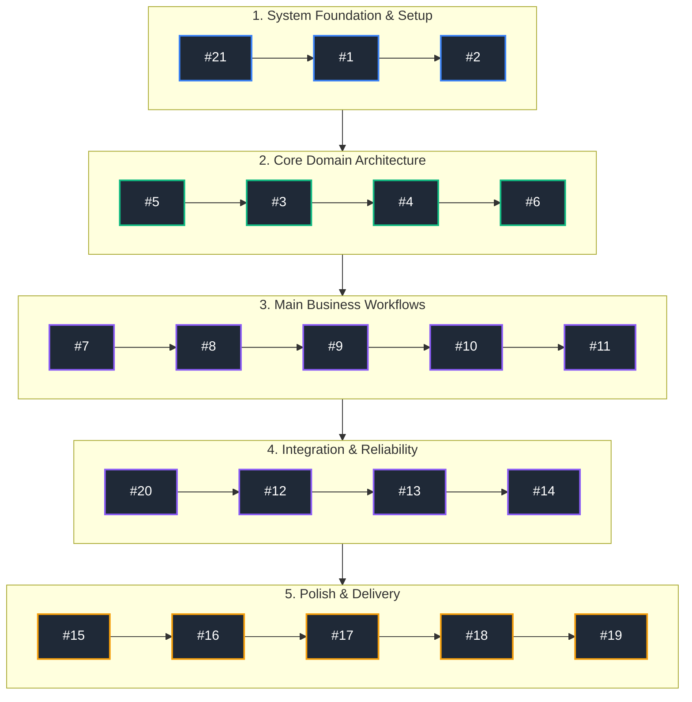
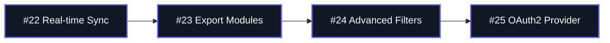
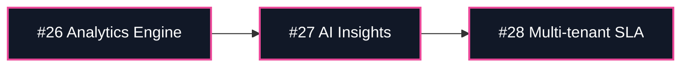

# Product Roadmap & Delivery Strategy

Welcome to the central product development roadmap. This document outlines the sequential execution path for our Minimum Viable Product (MVP) release, as well as the strategic milestones planned for post-MVP iteration cycles.

---

## Strategic Vision & Execution Strategy

Our engineering workflow follows a strictly ordered, dependency-driven release pipeline. Items are executed sequentially to minimize merge conflicts, unblock technical dependencies, and ensure scalable architectural progression.

```
       [ MVP Pipeline ]                       [ v1.1 Enhancements ]           [ v2.0 Scale & Analytics ]
#21 ➔ #1 ➔ #2 ➔ #5 ➔ ... ➔ #19   ➔➔➔   [Milestone 2 Execution]   ➔➔➔   [Milestone 3 Execution]
```

---

## Roadmap Milestones Overview

| Milestone | Target Horizon | Objective & Focus | Status |
| :--- | :--- | :--- | :--- |
| **Milestone 1: Core MVP** | Sprint 1 – 4 | Core architecture, essential user journeys, and foundational stability | 🟡 In Progress |
| **Milestone 2: Feature Upgrades** | Sprint 5 – 7 | Performance optimization, advanced integrations, and user experience enhancements | 🔵 Planned |
| **Milestone 3: Scale & Analytics** | Sprint 8+ | Enterprise scalability, deep metrics, automated intelligence | ⚪ Future Backlog |

---

## 🚀 Milestone 1: Minimum Viable Product (MVP)

The following dependency chain dictates the exact sequence in which issues must be picked up, developed, code-reviewed, and merged.

### Sequential Issue Dependency Flow
> **Execution Chain:** `#21` ➔ `#1` ➔ `#2` ➔ `#5` ➔ `#3` ➔ `#4` ➔ `#6` ➔ `#7` ➔ `#8` ➔ `#9` ➔ `#10` ➔ `#11` ➔ `#20` ➔ `#12` ➔ `#13` ➔ `#14` ➔ `#15` ➔ `#16` ➔ `#17` ➔ `#18` ➔ `#19`



### Detailed Issue Checklist & Objectives

#### Phase 1: System Foundation & Infrastructure
- [ ] **#21** — Environment Configuration & Repository Scaffolding
- [ ] **#1** — Core Database Schema & Migration Setup
- [ ] **#2** — Authentication & Authorization Middleware

#### Phase 2: Core Domain Architecture
- [ ] **#5** — Domain Entity Definitions & Data Access Layer (DAL)
- [ ] **#3** — User Profile Management APIs
- [ ] **#4** — Core Business Logic Service Layer
- [ ] **#6** — Primary API Gateway & Endpoint Routing Setup

#### Phase 3: Main Business Workflows
- [ ] **#7** — Primary Dashboard Interface & State Management
- [ ] **#8** — Data Ingestion / Input Workflow Components
- [ ] **#9** — Business Process Pipeline Handler
- [ ] **#10** — Validation, Error Handling & Logging Interceptors
- [ ] **#11** — User Notification System Implementation

#### Phase 4: Integration, Testing & Reliability
- [ ] **#20** — Third-party Service API Integrations
- [ ] **#12** — Unit & Integration Test Suite Coverage
- [ ] **#13** — End-to-End (E2E) Critical Path Automation
- [ ] **#14** — Security Auditing, Rate Limiting & Input Sanitization

#### Phase 5: Final Polish, CI/CD & Launch
- [ ] **#15** — Performance Optimization & Database Indexing
- [ ] **#16** — Cross-browser / Mobile Responsiveness Polish
- [ ] **#17** — Staging Environment Deployment & Verification
- [ ] **#18** — User Acceptance Testing (UAT) & Bug Fixes
- [ ] **#19** — Production CI/CD Release & MVP Rollout

---

## 🔮 Future Releases & Upgrades (Post-MVP)

Future feature sets will follow the same strict dependency-driven sequence once MVP sign-off is completed.

### Milestone 2: Feature Upgrades & Enhancements (v1.1)



- [ ] **#22** — Real-time WebSockets Synchronization
- [ ] **#23** — Custom Report Generation & Multi-format Export (PDF/CSV)
- [ ] **#24** — Advanced Search & Filter Engine with Indexing
- [ ] **#25** — OAuth2 Social Login Providers Expansion

### Milestone 3: Scale & Intelligence (v2.0)



- [ ] **#26** — Analytics Telemetry & Event Tracking Engine
- [ ] **#27** — Automated AI-driven Insights & Recommendations
- [ ] **#28** — Enterprise Multi-tenancy & SLA Controls

---

## 📐 Governance & Execution Guidelines

1. **Strict Dependency Order:** Developers must not start work on a downstream issue until all upstream prerequisite issues in the chain are merged or unblocked.
2. **Issue Linking:** Pull Requests (PRs) must reference their respective issue ID (e.g., `Closes #21`) to maintain clear traceability in GitHub Projects.
3. **Continuous Revision:** This roadmap is a living document. Any additions or sequence changes must be discussed in sprint planning and reflected here immediately.

---
*Document Version: 1.0.0 | Maintained by Engineering & Product Team*