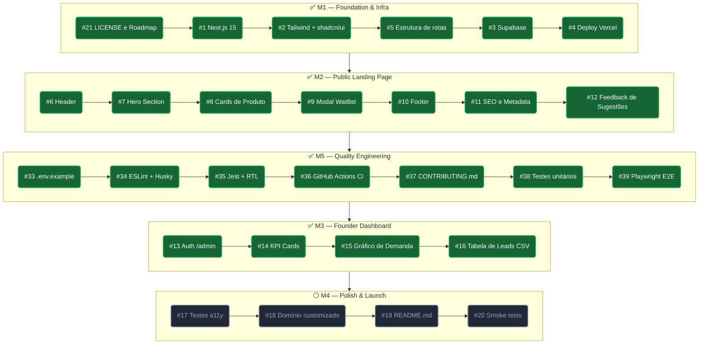

# Roadmap — Kairos Labs

Documento vivo que define a sequência de execução do projeto, organizado por milestones e dependências técnicas.
Repositório: `CabPiz/kairos-labs` | Project Board: nº 3

---

## Visão Geral dos Milestones

| Milestone | Foco | Status |
| :--- | :--- | :--- |
| **M1 — Foundation & Infra** | Setup do repositório, stack, CI/CD e banco de dados | ✅ Concluído |
| **M2 — Public Landing Page** | Hero, vitrine de produtos, modal de waitlist, SEO | ✅ Concluído |
| **M5 — Quality Engineering** | Infraestrutura de testes, CI automatizado e documentação | ✅ Concluído |
| **M3 — Founder Dashboard** | Rota /admin protegida, KPIs, gráficos e exportação CSV | ✅ Concluído |
| **M4 — Polish & Launch** | Acessibilidade, domínio customizado, README e go-live | ⚪ Planejado |

> **Regra de execução:** nenhuma issue downstream é iniciada sem o merge da upstream que a desbloqueia.

---

## Sequência de Execução

```
[M1 ✅] → [M2 ✅ #11→#12] → [M5 ✅ #33→#34→#35→#36→#37→#38→#39] → [M3 ✅ #13→#14→#15→#16] → [M4 ⚪ #17→#18→#19→#20]
```



---

## M1 — Foundation & Infra ✅ Concluído

| # | Issue | Status |
|---|---|---|
| #21 | Criar arquivo LICENSE e Roadmap.md | ✅ |
| #1 | Inicializar projeto Next.js 15 com App Router | ✅ |
| #2 | Configurar Tailwind CSS v4 + shadcn/ui | ✅ |
| #5 | Estrutura de pastas e arquitetura de rotas | ✅ |
| #3 | Criar projeto e tabela no Supabase | ✅ |
| #4 | Configurar variáveis de ambiente e deploy na Vercel | ✅ |

---

## M2 — Public Landing Page ✅ Concluído

| # | Issue | Status |
|---|---|---|
| #6 | Header com logo e badge INPI | ✅ |
| #7 | Hero Section com headline e CTA | ✅ |
| #8 | Cards de Produtos (Vitrine) | ✅ |
| #9 | Modal de Waitlist (captura de lead segmentada) | ✅ |
| #10 | Footer institucional | ✅ |
| #11 | SEO e Metadata (Next.js Metadata API) | ✅ |
| #12 | Interface de Feedback de Sugestões (Landing Page) | ✅ |

---

## M5 — Quality Engineering ✅ Concluído

Executado após a conclusão do M2. Estabelece a infraestrutura de qualidade que sustentará todo o desenvolvimento do M3 em diante.

| # | Issue | Dependência | Status |
|---|---|---|---|
| #33 | Adicionar `.env.example` e documentar variáveis de ambiente | — | ✅ |
| #34 | Configurar ESLint + lint-staged + Husky | #33 | ✅ |
| #35 | Configurar Jest + React Testing Library | #34 | ✅ |
| #36 | Criar pipeline CI no GitHub Actions (build + lint + test) | #35 | ✅ |
| #37 | Criar `CONTRIBUTING.md` com guia de desenvolvimento local | #36 | ✅ |
| #38 | Escrever testes unitários nos componentes principais | #35 | ✅ |
| #39 | Configurar Playwright para testes E2E | #36 | ✅ |

---

## M3 — Founder Dashboard ✅ Concluído

Desbloqueado após conclusão do M5. A autenticação (#13) é pré-requisito para todas as demais issues deste milestone.

| # | Issue | Dependência | Status |
|---|---|---|---|
| #13 | Autenticação com Supabase Auth na rota /admin | — | ✅ |
| #14 | KPI Cards (totais e crescimento) | #13 | ✅ |
| #15 | Gráfico de Demanda por Produto | #13 | ✅ |
| #16 | Tabela de Leads com exportação CSV | #13 | ✅ |

---

## M4 — Polish & Launch ⚪ Planejado

Etapa final antes do go-live. Executada após o M3 completo.

| # | Issue | Status |
|---|---|---|
| #17 | Testes de acessibilidade (a11y) | ⚪ |
| #18 | Configurar domínio customizado na Vercel | ⚪ |
| #19 | README.md completo do projeto | ⚪ |
| #20 | Smoke tests pré-lançamento | ⚪ |

---

## Governança

1. **Ordem de dependência:** nenhuma issue downstream é iniciada sem merge da upstream que a desbloqueia.
2. **Rastreabilidade:** todo PR referencia sua issue com `Closes #N` ou `Ref #N`.
3. **Quality Gate:** nenhum PR é mergeado com issues abertas no SonarCloud.
4. **Documento vivo:** qualquer adição ou mudança de sequência deve ser refletida aqui imediatamente.

---

*ROADMAP.md v2.3 — M3 concluído (issues #13–#16 mergeadas) | Kairos Labs*
